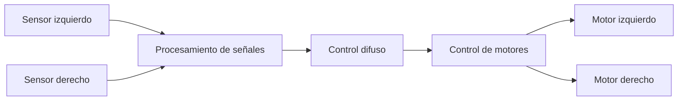

# Carrito Seguidor de Línea con Lógica Difusa

Este proyecto presenta un **carrito autónomo seguidor de línea** basado en un microcontrolador STM32 y un sistema de control por **lógica difusa (Fuzzy Logic)**. El objetivo es detectar la posición de la línea y ajustar la velocidad de los motores para mantener el seguimiento de forma estable y eficiente.

## ✨ Características principales
- Seguimiento automático de línea mediante sensores infrarrojos.
- Control adaptativo usando lógica difusa.
- Implementación sobre plataforma STM32.
- Diseño orientado a demostración, pruebas y desarrollo académico.

## 🧠 ¿Cómo funciona?
El sistema lee la señal de los sensores, identifica si el robot está ligeramente a la izquierda, derecha o sobre la línea, y genera una respuesta para corregir el movimiento de los motores.

## 🛠️ Diseño del sistema

### Componentes principales
- **Microcontrolador:** STM32
- **Sensores:** IR para detección de línea
- **Actuadores:** motores DC
- **Control:** algoritmo difuso basado en reglas de Mamdani
- **Fuente de alimentación:** sistema de batería / fuente adecuada para el carrito

## 📷 Imagen del prototipo

## 🎥 Demo
Aquí puedes ver una demostración del funcionamiento del carrito:

https://github.com/user-attachments/assets/0d9d8957-ae0a-4fae-b08e-12143651e8d6

## 👥 Equipo
- Roberto López - [Roberto](https://github.com/Roberto-dot)
- Kevin Lara - [Gyonyu](https://github.com/Gyonyu)
- Das Reyes - [Das](https://github.com/DasReyxr)

