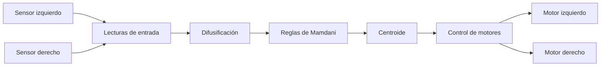

# Carrito Seguidor de Línea con Lógica Difusa

Este proyecto presenta un **carrito autónomo seguidor de línea** basado en un microcontrolador STM32 y un sistema de control por **lógica difusa (Fuzzy Logic)**. El objetivo es detectar la posición de la línea y ajustar la velocidad de los motores para mantener el seguimiento de forma estable y eficiente.

## ✨ Características principales
- Seguimiento automático de línea mediante sensores infrarrojos.
- Control adaptativo usando lógica difusa.
- Implementación sobre plataforma STM32.
- Diseño orientado a demostración, pruebas y desarrollo académico.

## 🧠 ¿Cómo funciona?
El sistema lee la señal de los sensores, identifica si el robot está ligeramente a la izquierda, derecha o sobre la línea, y genera una respuesta para corregir el movimiento de los motores.

## 🛠️ Diseño del sistema

El sistema se basa en una secuencia clara de procesamiento:

1. **Adquisición de datos**: se toman las lecturas de los dos sensores.
2. **Difusión de entradas**: los valores obtenidos se difuminan para representar el grado de pertenencia a las variables difusas.
3. **Reglas de Mamdani**: se aplican las reglas difusas para evaluar la acción de control.
4. **Defuzzificación por centroide**: se obtiene un valor numérico que indica la corrección necesaria.
5. **Actuación sobre los motores**: el resultado se envía al puente H para controlar el movimiento del carrito.

### Componentes principales
- **Microcontrolador:** BlackPill STM32F411CEU
- **Sensores:** QTR-8A
- **Puente H:** TB6612FNG
- **Control:** lógica difusa basada en reglas de Mamdani
- **Actuadores:** motores DC
- **Fuente de alimentación:** batería o fuente adecuada para el sistema

## 📷 Imagen del prototipo

A continuación se muestra una vista del prototipo desarrollado para el carrito seguidor de línea:

## 🎥 Demo
Aquí puedes ver una demostración del funcionamiento del carrito:

https://github.com/user-attachments/assets/0d9d8957-ae0a-4fae-b08e-12143651e8d6

## 👥 Equipo
- Roberto López - [Roberto](https://github.com/Roberto-dot)
- Kevin Lara - [Gyonyu](https://github.com/Gyonyu)
- Das Reyes - [Das](https://github.com/DasReyxr)

